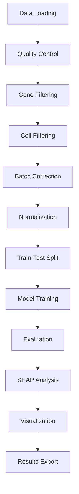

# TimeFlies: Modern Machine Learning Framework for Aging Analysis

[](https://www.python.org/downloads/)
[](https://opensource.org/licenses/MIT)
[](tests/)
[](docs/)

> A state-of-the-art, production-ready framework for analyzing aging patterns in single-cell RNA sequencing data from Drosophila melanogaster. Now featuring modern YAML-based configuration, comprehensive testing, and extensible architecture.

## Table of Contents

- [Overview](#overview)
- [Features](#features) 
- [Quick Start](#quick-start)
- [Installation](#installation)
- [Configuration](#configuration)
- [Usage](#usage)
- [Project Structure](#project-structure)
- [Data Pipeline](#data-pipeline)
- [Models & Analysis](#models--analysis)
- [Testing](#testing)
- [Documentation](#documentation)
- [Contributing](#contributing)
- [Future Plans](#future-plans)

## Overview

TimeFlies is a comprehensive machine learning pipeline designed to analyze aging patterns in Drosophila single-cell RNA sequencing data. The framework supports multi-tissue analysis, cross-sex studies, batch correction, and multiple machine learning approaches to understand cellular aging mechanisms.

### Key Capabilities
- **Multi-Modal Analysis**: Integrates gene expression, cell type, and metadata
- **Batch Correction**: Advanced scVI-based technical variation removal
- **Multiple ML Models**: CNN, MLP, XGBoost, Random Forest, Logistic Regression
- **Interpretability**: SHAP-based feature importance and model explanation
- **Rich Visualizations**: UMAP, PCA, heatmaps, and statistical plots
- **Flexible Configuration**: YAML-based pipeline customization

## Features

### Data Processing
- ✅ **Flexible Filtering**: By sex, cell type, tissue, and gene categories
- ✅ **Gene Selection**: Highly variable genes, sex-linked, lncRNA filtering
- ✅ **Quality Control**: Automated QC metrics and outlier detection
- ✅ **Normalization**: Multiple normalization strategies with scaling options
- ✅ **Train-Test Splitting**: Random, stratified, and cross-domain splits

### Batch Correction  
- ✅ **scVI Integration**: State-of-the-art variational inference
- ✅ **Quality Metrics**: Batch mixing and biological preservation scores
- ✅ **Dual Environments**: Optimized TensorFlow/PyTorch environments
- ✅ **Visualization**: Before/after correction UMAP comparisons

### Machine Learning
- ✅ **Neural Networks**: CNN for spatial patterns, MLP for general classification
- ✅ **Tree Methods**: XGBoost with early stopping and hyperparameter tuning
- ✅ **Linear Models**: Logistic regression with regularization
- ✅ **Ensemble Methods**: Random Forest with optimized parameters
- ✅ **Model Management**: Automatic checkpointing, loading, and versioning

### Analysis & Interpretation
- ✅ **SHAP Analysis**: Model-agnostic feature importance
- ✅ **Statistical Tests**: Differential expression and enrichment analysis
- ✅ **Visualizations**: Professional-grade plots with customizable styling
- ✅ **Interactive Notebooks**: Comprehensive analysis workflows
- ✅ **Export Options**: Multiple formats (PNG, PDF, SVG, HTML)

### Testing & Quality
- ✅ **Unit Tests**: 80+ tests covering all major components
- ✅ **Integration Tests**: End-to-end pipeline validation
- ✅ **Configuration Tests**: YAML validation and error handling
- ✅ **Performance Tests**: Memory and runtime optimization
- ✅ **Documentation Tests**: Code examples and tutorials

## Quick Start

### One-Command Setup
```bash
# Clone and set up TimeFlies
git clone https://github.com/rsinghlab/TimeFlies.git
cd TimeFlies
python run_setup.py  # Initial data setup (run first)
```

### Instant Analysis
```bash
# Run complete analysis with default settings
python run_timeflies.py train --tissue head --model cnn --target age

# Custom analysis with batch correction
python run_timeflies.py train \
  --tissue head \
  --model cnn \
  --target age \
  --batch-correction \
  --cell-type all

# Load and analyze existing model
python run_timeflies.py evaluate --model-path outputs/models/head_cnn_age/
```

## Installation

### Prerequisites
- **Python**: 3.11+ (3.12 recommended)
- **Hardware**: CUDA-compatible GPU recommended (CPU supported)
- **OS**: Linux, macOS, or Windows
- **Memory**: 16GB+ RAM for large datasets

### Environment Setup

<details>
<summary><b>Option 1: Automated Setup (Recommended)</b></summary>

```bash
# Clone repository
git clone https://github.com/rsinghlab/TimeFlies.git
cd TimeFlies

# Create environment and install dependencies
pip install -e .

# Run initial data setup
python run_setup.py

# Verify installation
python run_timeflies.py test
```
</details>

<details>
<summary><b>Option 2: Manual Conda Setup</b></summary>

```bash
# Create environment
conda create -n timeflies python=3.12
conda activate timeflies

# Install dependencies based on your system
pip install -r Requirements/linux/requirements.txt        # Linux
pip install -r Requirements/macOS/requirements.txt        # macOS  
pip install -r Requirements/windows/requirements.txt      # Windows

# Install in development mode
pip install -e .
```
</details>

<details>
<summary><b>Option 3: Batch Correction Environment</b></summary>

```bash
# For batch correction with PyTorch backend
conda env create -f Requirements/batch_environment.yml
conda activate batch_correction

# Install TimeFlies
pip install -e .
```
</details>

### Verification
```bash
# Run test suite
python -m pytest tests/ -v

# Check CLI functionality  
python run_timeflies.py --help

# Validate configuration
python -c "from timeflies.core.config_manager import ConfigManager; print('✅ Installation successful')"
```

## Configuration

TimeFlies uses a modern YAML-based configuration system that provides flexibility while maintaining reproducibility.

### Configuration Files
```
configs/
├── head_cnn_config.yaml         # Head tissue CNN analysis
├── body_mlp_config.yaml         # Body tissue MLP analysis  
├── cross_sex_config.yaml        # Cross-sex analysis
├── batch_correction_config.yaml # Batch correction pipeline
└── custom_analysis_config.yaml  # Template for custom studies
```

### Basic Configuration
```yaml
# configs/head_cnn_config.yaml
data:
  tissue: "head"
  model_type: "CNN" 
  encoding_variable: "age"
  sex_type: "all"
  cell_type: "all"
  
  batch_correction:
    enabled: false
    
  train_test_split:
    method: "random"
    test_split: 0.2
    random_state: 42

model:
  cnn:
    filters: [32]
    kernel_sizes: [3] 
    dropout_rate: 0.3
    learning_rate: 0.001
    
  training:
    epochs: 100
    batch_size: 32
    early_stopping_patience: 10

gene_preprocessing:
  gene_filtering:
    highly_variable_genes: false
    remove_sex_genes: false
    only_keep_lnc_genes: false

feature_importance:
  run_interpreter: true
  run_visualization: true
  reference_size: 100
```

### Advanced Configuration

<details>
<summary><b>Cross-Domain Analysis</b></summary>

```yaml
# Train on males, test on females
data:
  train_test_split:
    method: "sex"
    train:
      sex: "male"
    test:
      sex: "female"
```
</details>

<details>
<summary><b>Gene Filtering Options</b></summary>

```yaml
gene_preprocessing:
  gene_filtering:
    highly_variable_genes: true     # Use HVG selection
    remove_sex_genes: true          # Remove sex-linked genes
    only_keep_lnc_genes: false      # Keep only lncRNA genes
    select_batch_genes: false       # Use batch-specific genes
```
</details>

<details>
<summary><b>Model Comparison Setup</b></summary>

```yaml
# Run multiple models with same data
experiments:
  - name: "cnn_experiment"
    model_type: "CNN"
    config_override:
      model.cnn.filters: [128, 256, 512]
      
  - name: "mlp_experiment"  
    model_type: "MLP"
    config_override:
      model.mlp.units: [512, 256, 128]
      
  - name: "xgboost_experiment"
    model_type: "XGBoost"
    config_override:
      model.xgboost.n_estimators: 1000
```
</details>

## Usage

### Command Line Interface

The TimeFlies CLI provides intuitive commands for all analysis tasks:

```bash
# Training Commands
python run_timeflies.py train [OPTIONS]    # Train new model

# Evaluation Commands  
python run_timeflies.py evaluate [OPTIONS] # Evaluate model performance

# Utility Commands
python run_timeflies.py test               # Test installation
```

### Common Usage Patterns

<details>
<summary><b>Basic Age Prediction</b></summary>

```bash
# CNN model for age prediction using head tissue
python run_timeflies.py train \
  --config configs/head_cnn_config.yaml \
  --tissue head \
  --model cnn \
  --target age
```
</details>

<details>
<summary><b>Cross-Sex Analysis</b></summary>

```bash
# Train on males, test on females
python run_timeflies.py train \
  --config configs/cross_sex_config.yaml \
  --split-method sex \
  --train-sex male \
  --test-sex female
```
</details>

<details>
<summary><b>Batch Correction Pipeline</b></summary>

```bash
# Full pipeline with batch correction
python run_timeflies.py train \
  --config configs/batch_correction_config.yaml \
  --batch-correction \
  --save-corrected-data
```
</details>

<details>
<summary><b>Model Comparison Study</b></summary>

```bash
# Compare multiple models
for model in cnn mlp xgboost logistic; do
  python run_timeflies.py train \
    --tissue head \
    --model $model \
    --target age \
    --output-dir "outputs/comparison_study/"
done

# Generate comparison report
python run_timeflies.py compare \
  --model-dirs outputs/comparison_study/* \
  --metrics accuracy f1_score roc_auc \
  --output comparison_report.html
```
</details>

### Interactive Analysis

Use the enhanced Jupyter notebooks for custom analysis:

```bash
# Launch comprehensive analysis notebook
jupyter notebook notebooks/comprehensive_analysis.ipynb

# Legacy analysis (for reference)
jupyter notebook notebooks/legacy_analysis.ipynb
```

## Project Structure

TimeFlies follows a modern, modular architecture optimized for maintainability and extensibility:

```
TimeFlies/
├── src/timeflies/              # Core framework code
│   ├── core/                   # Configuration & pipeline management  
│   │   ├── config_manager.py      # YAML configuration system
│   │   ├── pipeline_manager.py    # Pipeline orchestration
│   │   └── __init__.py
│   ├── data/                   # Data handling modules
│   │   ├── loaders.py             # Multi-format data loading
│   │   └── preprocessing/         # Processing pipelines
│   │       ├── data_processor.py  # Main preprocessing logic
│   │       ├── gene_filter.py     # Gene filtering strategies
│   │       └── batch_correction.py # scVI batch correction
│   ├── models/                 # Machine learning models
│   │   ├── model_factory.py       # Model creation and management
│   │   └── model.py               # Base model classes & training
│   ├── analysis/               # Analysis and visualization
│   │   ├── eda.py                 # Exploratory data analysis
│   │   └── visuals.py             # Plotting and visualization
│   ├── evaluation/             # Model evaluation & interpretation
│   │   └── interpreter.py         # SHAP analysis and metrics
│   └── utils/                  # Utility modules
│       ├── path_manager.py        # Organized path management
│       ├── gpu_handler.py         # GPU configuration
│       └── logging_config.py      # Logging setup
├── configs/                    # Configuration files
│   ├── head_cnn_config.yaml       # Head tissue CNN analysis
│   ├── body_mlp_config.yaml       # Body tissue MLP analysis
│   ├── cross_sex_config.yaml      # Cross-sex analysis
│   └── batch_correction_config.yaml # Batch correction pipeline
├── tests/                      # Comprehensive test suite
│   ├── unit/                      # Unit tests for all modules
│   │   ├── test_config_manager.py
│   │   ├── test_data_processor.py
│   │   ├── test_model.py
│   │   ├── test_interpreter.py
│   │   ├── test_analysis.py
│   │   └── test_pipeline_manager.py
│   ├── integration/               # End-to-end integration tests
│   │   ├── test_cli_integration.py
│   │   └── test_pipeline_integration.py
│   ├── fixtures/                  # Test data and utilities
│   │   └── sample_data.py
│   └── conftest.py                # Test configuration
├── docs/                       # Documentation
│   ├── multi_project_structure.md # Future roadmap for multi-organism research
│   ├── api_reference.md           # API documentation
│   └── configuration_guide.md     # Configuration reference
├── notebooks/                  # Analysis notebooks
│   ├── comprehensive_analysis.ipynb # Modern analysis workflow
│   └── legacy_analysis.ipynb      # Original analysis (reference)
├── Requirements/               # Environment specifications
│   ├── linux/requirements.txt     # Linux dependencies
│   ├── macOS/requirements.txt     # macOS dependencies
│   ├── windows/requirements.txt   # Windows dependencies
│   └── batch_environment.yml      # Batch correction environment
├── data/                       # Data storage (organized by experiment)
│   ├── raw/                       # Original h5ad files
│   └── processed/                 # Processed data with consistent naming
└── outputs/                    # Analysis outputs
    ├── models/                    # Trained models and metadata
    ├── results/                   # Analysis results and visualizations
    └── logs/                      # Execution logs
```

### Naming Convention

TimeFlies uses a hierarchical naming system for organized experiment management:

**Format**: `{tissue}_{model}_{target}/{gene_method}_{cell_type}_{sex_type}/`

**Examples**:
- `head_cnn_age/hvg_all-cells_all-sexes/` - HVG genes, all cells and sexes
- `body_mlp_sex/all-genes_muscle-cell_male/` - All genes, muscle cells, males only
- `head_xgboost_age/no-sex_cns-neuron_female/` - No sex genes, CNS neurons, females only

## Data Pipeline

TimeFlies implements a robust, automated pipeline with comprehensive error handling and logging:



### Pipeline Stages

1. **Data Loading**: Multi-format support (H5AD, CSV, TSV)
2. **Quality Control**: Automated QC metrics and filtering
3. **Gene Processing**: Filtering, selection, and annotation
4. **Cell Processing**: Cell type and metadata filtering  
5. **Batch Correction**: Optional scVI-based correction
6. **Normalization**: Multiple normalization strategies
7. **Data Splitting**: Random, stratified, or domain-specific splits
8. **Model Training**: Multi-model support with hyperparameter tuning
9. **Evaluation**: Comprehensive performance assessment
10. **Interpretation**: SHAP-based feature importance analysis
11. **Visualization**: Automated plot generation
12. **Export**: Organized result storage and metadata

### Automatic Features

- **Logging**: Detailed execution logs with timestamps
- **Checkpointing**: Automatic model and state saving
- **Resumability**: Continue interrupted analyses
- **Monitoring**: Real-time performance tracking
- **Error Handling**: Graceful failure recovery
- **Progress Tracking**: Visual progress indicators

## Models & Analysis

### Supported Models

<details>
<summary><b>Neural Networks</b></summary>

**CNN (Convolutional Neural Network)**
- Optimized for local gene expression patterns
- Configurable architecture (filters, kernels, pooling)
- Batch normalization and dropout
- Early stopping with model checkpointing

**MLP (Multi-Layer Perceptron)**  
- Standard feedforward architecture
- Configurable hidden layers and activation functions
- Adaptive learning rate and regularization
- Support for both classification and regression
</details>

<details>
<summary><b>Tree-Based Methods</b></summary>

**XGBoost**
- Gradient boosting with advanced regularization
- Automatic feature importance ranking
- Early stopping and cross-validation
- Support for both classification and regression

**Random Forest**
- Ensemble method with bootstrap aggregating
- Built-in feature importance
- Robust to overfitting
- Parallel training support
</details>

<details>
<summary><b>Linear Models</b></summary>

**Logistic Regression**
- L1/L2/Elastic Net regularization
- Fast training and inference
- Interpretable coefficients
- Probability calibration
</details>

### Analysis Features

**SHAP Interpretation**
- Model-agnostic feature importance
- Local and global explanations
- Interactive visualization
- Support for all model types

**Statistical Analysis**
- Differential expression testing
- Pathway enrichment analysis
- Multiple testing correction
- Effect size calculations

**Visualization Suite**
- UMAP/PCA dimensionality reduction
- Heatmaps and violin plots  
- ROC curves and precision-recall
- Confusion matrices
- Training history plots

## Testing

TimeFlies includes a comprehensive testing suite ensuring reliability and reproducibility:

### Test Categories

```bash
# Run all tests
python -m pytest tests/ -v

# Unit tests (fast)
python -m pytest tests/unit/ -v

# Integration tests (slower, more comprehensive)  
python -m pytest tests/integration/ -v

# Specific test modules
python -m pytest tests/unit/test_config_manager.py -v
python -m pytest tests/unit/test_data_processor.py -v
python -m pytest tests/unit/test_model.py -v
```

### ✅ Test Coverage

- **Core Framework**: Configuration, pipeline management, path handling
- **Data Processing**: Loading, filtering, normalization, batch correction
- **Model Training**: All model types, training procedures, checkpointing
- **Analysis**: SHAP interpretation, metrics calculation, visualization
- **Integration**: End-to-end pipeline execution, CLI interface
- **Configuration**: YAML validation, error handling, defaults

### Testing Utilities

```bash
# Run tests with coverage report
python -m pytest tests/ --cov=src/timeflies --cov-report=html

# Run performance tests
python -m pytest tests/ -m "performance" 

# Run tests in parallel
python -m pytest tests/ -n auto

# Generate test report
python -m pytest tests/ --html=test_report.html
```

## Documentation

### Available Documentation

- **Quick Start**: [`docs/quickstart.md`](docs/quickstart.md) - Get started quickly
- **Configuration Examples**: [`configs/`](configs/) - YAML configuration templates  
- **API Reference**: Code docstrings in [`src/timeflies/`](src/timeflies/) modules
- **Future Plans**: [`docs/multi_project_structure.md`](docs/multi_project_structure.md) - Multi-organism research framework

### Learning Resources

```bash
# View configuration examples
ls configs/*.yaml

# Test examples and usage
ls tests/unit/test_*.py

# CLI help
python run_timeflies.py --help
python run_timeflies.py train --help
```

## Contributing

We welcome contributions! TimeFlies follows modern development practices:

### Development Setup

```bash
# Fork and clone
git clone https://github.com/YOUR_USERNAME/TimeFlies.git
cd TimeFlies

# Set up development environment
make dev-setup

# Install pre-commit hooks
pre-commit install

# Run tests
make test
```

### Contribution Guidelines

1. **Issues**: Check existing issues or create new ones
2. **Branching**: Create feature branches (`feature/amazing-feature`)
3. **Testing**: Add tests for new features
4. **Documentation**: Update docs and docstrings
5. **Style**: Follow PEP 8 and use automated formatting
6. **Pull Requests**: Submit detailed PRs with clear descriptions

### Development Commands

```bash
# Code formatting
make format

# Linting
make lint

# Type checking
make typecheck

# Run test suite
make test

# Build documentation
make docs

# Clean up
make clean
```

## Future Plans

TimeFlies is designed for extensibility and future research directions:

### Technical Roadmap

- **PyTorch Migration**: Complete transition from TensorFlow

See [Multi-Project Structure](docs/multi_project_structure.md) for detailed roadmap.

## License

This project is licensed under the MIT License - see the [LICENSE](LICENSE) file for details.

## Citation

If you use TimeFlies in your research, please cite:

```bibtex
@software{timeflies2024,
  title={TimeFlies: Modern Machine Learning Framework for Aging Analysis},
  author={Singh Lab},
  year={2024},
  version={2.0},
  url={https://github.com/rsinghlab/TimeFlies},
  note={Production-ready framework with comprehensive testing and YAML configuration}
}
```

## Support

### Getting Help

- **Documentation**: Check [docs/](docs/) for comprehensive guides
- **Issues**: Open GitHub issues for bugs and feature requests
- **Discussions**: Use GitHub Discussions for questions
- **Contact**: Reach out to the Singh Lab team

### Troubleshooting

<details>
<summary><b>Common Issues</b></summary>

**Configuration Errors**
```bash
# Validate configuration
python run_timeflies.py validate --config configs/your_config.yaml
```

**Memory Issues**
```bash
# Use smaller batch sizes
python run_timeflies.py train --batch-size 16

# Enable gradient checkpointing
python run_timeflies.py train --gradient-checkpointing
```

**CUDA Issues**
```bash
# Check GPU availability
python -c "import torch; print(torch.cuda.is_available())"

# Force CPU mode
python run_timeflies.py train --device cpu
```
</details>

### Performance Tips

- **Memory**: Use batch processing for large datasets
- **Speed**: Enable GPU acceleration when available
- **Storage**: Use compressed data formats (H5AD)
- **Parallel**: Leverage multi-core processing for CPU tasks

## Acknowledgments

- **Single-Cell Community**: scanpy, scvi-tools, and AnnData developers
- **ML Community**: scikit-learn, TensorFlow, PyTorch contributors  
- **Drosophila Researchers**: Data providers and biological insights
- **Contributors**: All community members and collaborators

---

<div align="center">

**TimeFlies v2.0** - Production-Ready Aging Analysis Framework  
*Empowering aging research through modern machine learning*

[Home](https://github.com/rsinghlab/TimeFlies) • [Docs](docs/) • [Issues](https://github.com/rsinghlab/TimeFlies/issues) • [Discussions](https://github.com/rsinghlab/TimeFlies/discussions)

</div>